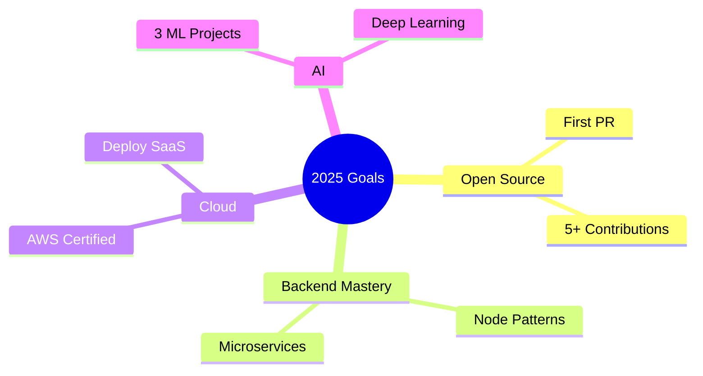

q<!-- ================================================= -->
<!--                🔥 HEADER SECTION 🔥               -->
<!-- ================================================= -->

  

  +Welcome+to+my+digital+universe;%3E+I+build+scalable+systems;%3E+Turning+coffee+into+code+since+2023;%3E+Future+AI+Engineer+%F0%9F%A4%96"/>

  
  
  

---

# 🧠 WHO AM I?

🎓 Computer Science Student  
🚀 Building **Flow Scrape** (AI Web Scraper)  
☁️ Learning AWS + Cloud Architecture  
🤖 Exploring Machine Learning & Deep Learning  
🔧 Backend-focused Developer  
📈 Passionate about scalable systems  
🎯 2025 Goal: Open Source Contributor

 

---

# 🛠 TECH STACK

### ⚡ Languages

### 🌐 Frontend

### ⚙ Backend

### 🗄 Databases

### ☁ DevOps

---

# 🚀 FEATURED PROJECTS

## 🚀 Flow Scrape

AI-powered scalable scraping platform  
Next.js • Puppeteer • PostgreSQL • Cloud Deployment

---

## 📚 Online Book Store

Full authentication & validation system

---

## ☁ Cloud Storage Platform

Secure file upload system with AWS backend

---

# 📊 GITHUB ANALYTICS

  

  

---

# 🎯 2025 ROADMAP

---

# 🏆 ACHIEVEMENTS

---

# 📫 CONNECT WITH ME

---

  

  MADE WITH ❤️ BY VAMSHA VARDHAN

